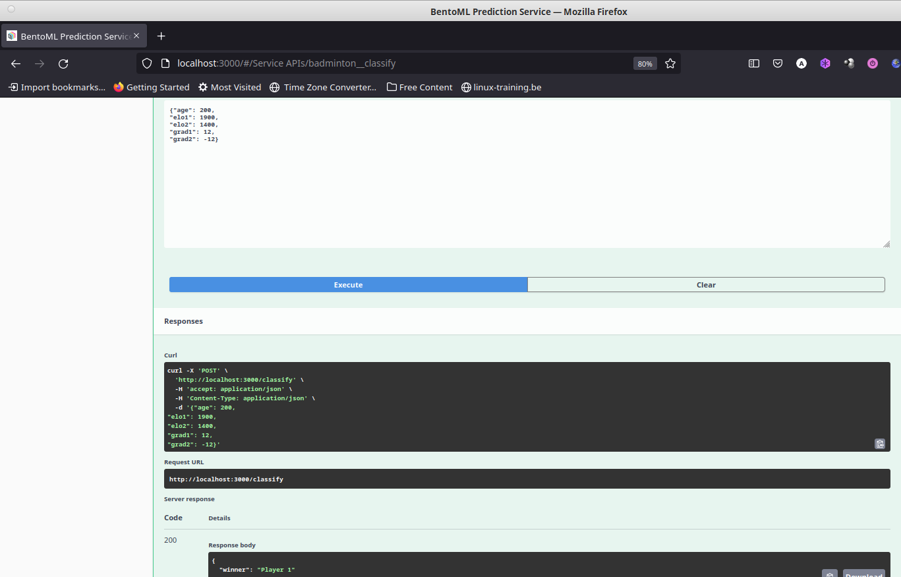
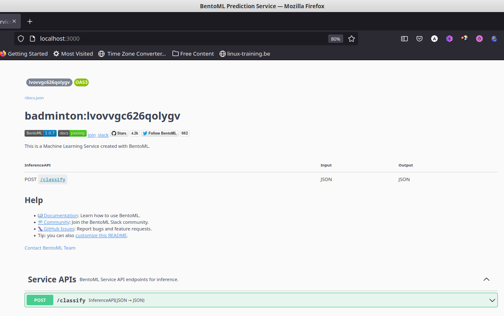

# Table of Contents

1.  [Description of the problem](#orgd962c3a)
    1.  [Dataset](#orge303f99)
2.  [Instructions on how to run the project](#orga38f882)
    1.  [Details on dataset analysis and selection of best model](#org7989f79)
    2.  [Model training](#orgc054f89)
    3.  [Serving the model locally](#orgf0d8b90)
    4.  [Containerizing the model (with Docker)](#org9717f16)
    5.  [Deploying to AWS](#org238344f)

# Description of the problem

Being a Spanish badminton player, I'm a fan of our most talented player,
Carolina Marín. So, the problem to solve for this midterm project is to see if
Machine Learning can help us predict the winner in women's singles badminton
matches, based on players' performance in past matches.

## Dataset

The data to be used is the "Badminton BWF World Tour" dataset at Kaggle
(<https://www.kaggle.com/datasets/sanderp/badminton-bwf-world-tour>). These data
can be found in the directory BWF-Data, though we have only kept the data for
women's singles matches (ws.csv), since that is the only data we are interested
in for this project. 

This file collects data for all women's singles Badminton World Federation (BWF)
World Tour (2018-04/2021) tournaments, with a total number of 2975 matches and
with 38 features for each match. 

In order to predict the winner of future matches, these data have to be heavily
modified, since the dataset contains information about each tournament, but not
about the given strength of each player, which is the information we would need
to predict the outcome of future matches. 

# Instructions on how to run the project

## Details on dataset analysis and selection of best model

The notebook **notebook.ipynb** has a detailed description of all the data
exploration, cleaning, feature engineering, etc. done for this project. It also
contains a detailed explanation of the different models and the tuning
experiments performed in order to decide on the best model for this dataset.

## Model training

Based on the analysis done in the notebook **notebook.ipynb**, the Python script
**train.py** performs all the necessary steps to go from the original data to a
BentoML model. For example, if we run it inside IPython:

    In [1]: %run train.py
    
    Training the Random Forest Classifier with following parameters: 
    estimatores=100 
    max_depth=5 
    min_samples_leaf=20
      
    Accuracy score on final test data: -> 0.746
      
    Saving model as a Bento
      
    In [2]: ! bentoml models list badminton_prediction
     Tag                                    Module           Size        Creation Time       
     badminton_prediction:pcydp6s6z6lhxygv  bentoml.sklearn  416.53 KiB  2022-11-07 19:07:49 

## Serving the model locally

We can serve the model locally, with BentoML and the Python script **predict.py**,
simply by running 

    $ bentoml serve --production predict.py:svc

The script **predict.py** loads the latest **badmintonprediction** model available
locally, which can be used via the Swagger UI with a browser, using the URI
**<http://localhost:3000>**. Both input and output are formatted as JSON data, and
the input expects the fields: **age**, **elo1**, **elo2**, **grad1** and **grad2** (see
the notebook **notebook.ipynb** for details about the meaning of each of these
features). 

Below we can see how this looks locally in the web browser, after entering some
data for Player1 and Player2, and how we get the prediction that the winner will
be Player1:

## Containerizing the model (with Docker)

To containerize the model with all the required dependencies into a Docker
container we use again BentoML, which makes the whole process very simple. We
just have to create the given **bentofile.yaml** file, which specifies a few basic
details, like the owner of the project, its name, and the necessary dependencies
(in this case, just python and the sklearn package). After that, we just have to
issue the command `bentoml build`, that will create a Bento. From here a Docker
container can be created with the command `bentoml containerize
badminton:latest`. Below we can see the sample output of running both commands:

    (ml-zoomcamp) angelv@sieladon:~/.../midterm-project/midterm-mlzoomcamp$ bentoml build
    Building BentoML service "badminton:lvovvgc626qolygv" from build context "/home/angelv/Learning/ML-Zoomcamp/mlbookcamp-own/midterm-project/midterm-mlzoomcamp"
    Packing model "badminton_prediction:pcydp6s6z6lhxygv"
    Locking PyPI package versions..
    /home/angelv/local/prog_langs/anaconda3/envs/ml-zoomcamp/lib/python3.9/site-packages/_distutils_hack/__init__.py:33: UserWarning: Setuptools is replacing distutils.
      warnings.warn("Setuptools is replacing distutils.")
    
    ██████╗░███████╗███╗░░██╗████████╗░█████╗░███╗░░░███╗██╗░░░░░
    ██╔══██╗██╔════╝████╗░██║╚══██╔══╝██╔══██╗████╗░████║██║░░░░░
    ██████╦╝█████╗░░██╔██╗██║░░░██║░░░██║░░██║██╔████╔██║██║░░░░░
    ██╔══██╗██╔══╝░░██║╚████║░░░██║░░░██║░░██║██║╚██╔╝██║██║░░░░░
    ██████╦╝███████╗██║░╚███║░░░██║░░░╚█████╔╝██║░╚═╝░██║███████╗
    ╚═════╝░╚══════╝╚═╝░░╚══╝░░░╚═╝░░░░╚════╝░╚═╝░░░░░╚═╝╚══════╝
    
    Successfully built Bento(tag="badminton:lvovvgc626qolygv")
    (ml-zoomcamp) angelv@sieladon:~/.../midterm-project/midterm-mlzoomcamp$ 

    (ml-zoomcamp) angelv@sieladon:~/.../midterm-project/midterm-mlzoomcamp$ bentoml containerize badminton:latest                                                      
    Building docker image for Bento(tag="badminton:lvovvgc626qolygv")...                                                                                                                                   
    [+] Building 33.6s (19/19) FINISHED                                                                                                                                                                    
     => [internal] load build definition from Dockerfile                                     0.0s                                                                                                          
     => => transferring dockerfile: 1.74kB                                                   0.0s                                                                                                          
     => [internal] load .dockerignore                                                        0.0s                                                                                                          
     => => transferring context: 2B                                                          0.0s                                                                                                          
     => resolve image config for docker.io/docker/dockerfile:1.4.3                           1.2s                                                                                                          
     => CACHED docker-image://docker.io/docker/dockerfile:1.4.3@sha256:9ba7531bd80fb0a85863  0.0s                                                                                                          
     => [internal] load .dockerignore                                                        0.0s                                                                                                          
     => [internal] load build definition from Dockerfile                                     0.0s                                                                                                          
     => [internal] load metadata for docker.io/library/python:3.9-slim                       0.7s                                                                                                          
     => [internal] load build context                                                        0.1s                                                                                                          
     => => transferring context: 4.11MB                                                      0.1s                                                                                                          
     => [base-debian  1/10] FROM docker.io/library/python:3.9-slim@sha256:f38c381db444c685b  0.0s                                                                                                          
     => CACHED [base-debian  2/10] RUN rm -f /etc/apt/apt.conf.d/docker-clean; echo 'Binary  0.0s                                                                                                          
     => CACHED [base-debian  3/10] RUN --mount=type=cache,target=/var/lib/apt     --mount=t  0.0s                                                                                                          
     => CACHED [base-debian  4/10] RUN groupadd -g 1034 -o bentoml && useradd -m -u 1034 -g  0.0s                                                                                                          
     => CACHED [base-debian  5/10] RUN mkdir /home/bentoml/bento && chown bentoml:bentoml /  0.0s                                                                                                          
     => CACHED [base-debian  6/10] WORKDIR /home/bentoml/bento                               0.0s                                                                                                          
     => [base-debian  7/10] COPY --chown=bentoml:bentoml . ./                                0.1s                                                                                                          
     => [base-debian  8/10] RUN --mount=type=cache,target=/root/.cache/pip bash -euxo pipe  23.6s                                                                                                          
     => [base-debian  9/10] RUN rm -rf /var/lib/{apt,cache,log}                              0.7s                                                                                                          
     => [base-debian 10/10] RUN chmod +x /home/bentoml/bento/env/docker/entrypoint.sh        0.5s                                                                                                           => exporting to image                                                                   6.3s      
     => => exporting layers                                                                  6.3s      
     => => writing image sha256:6ae5facae87d5fc7a4e5e809b8e13c34eaaa41cdef6634ab9fea6eca674  0.0s      
     => => naming to docker.io/library/badminton:lvovvgc626qolygv                            0.0s                                                                                                          Successfully built docker image for "badminton:latest" with tags "badminton:lvovvgc626qolygv"      
    To run your newly built Bento container, pass "badminton:lvovvgc626qolygv" to "docker run". For example: "docker run -it --rm -p 3000:3000 badminton:lvovvgc626qolygv serve --production".
    (ml-zoomcamp) angelv@sieladon:~/.../midterm-project/midterm-mlzoomcamp$

The previous step has created a Docker image, which we can check with the
command `docker image ls`:

    (ml-zoomcamp) angelv@sieladon:~/.../midterm-project/midterm-mlzoomcamp$ docker image ls
    REPOSITORY                                                               TAG                IMAGE ID       CREATED         SIZE
    badminton                                                                lvovvgc626qolygv   6ae5facae87d   3 minutes ago    746MB

and which we can run simply issuing the command suggested at the end of the
output generated by the `bentoml containerize` command:

    (ml-zoomcamp) angelv@sieladon:~/.../midterm-project/midterm-mlzoomcamp$ docker run -it --rm -p 3000:3000 badminton:lvovvgc626qolygv serve --production
    2022-11-07T20:09:08+0000 [INFO] [cli] Service loaded from Bento directory: bentoml.Service(tag="badminton:lvovvgc626qolygv", path="/home/bentoml/bento/")
    2022-11-07T20:09:08+0000 [WARNING] [cli] GPU not detected. Unable to initialize pynvml lib.
    2022-11-07T20:09:08+0000 [INFO] [cli] Environ for worker 0: set CPU thread count to 48                                                                                                                 
    2022-11-07T20:09:08+0000 [INFO] [cli] Prometheus metrics for HTTP BentoServer from "/home/bentoml/bento" can be accessed at http://localhost:3000/metrics.         
    2022-11-07T20:09:10+0000 [INFO] [cli] Starting production HTTP BentoServer from "/home/bentoml/bento" running on http://0.0.0.0:3000 (Press CTRL+C to quit)

We access the model in the same way as we did above in the section "Serving the
model locally", but this time everything is inside the Docker container. We can
see below how the tag corresponds to the docker image listed above:

## Deploying to AWS

Following the lectures on BentoML, I will deploy to AWS using the following
services: 

-   Elastic Container Registry and
-   Elastic Container Service

While I cannot describe all the detailed steps to deploy to AWS here, some of
them are straightforward (like creating an account in AWS, entering credit card
details to pay for storage and compute in AWS, etc.). I will describe here only
the most important points to follow:

-   In the Elastic Container Registry, create a repository
-   Install AWS CLI, and use it to push the docker container created earlier to
    the Elastic Container Registry repository from the previous step, following
    the steps in the AWS ECR page.
    
        (ml-zoomcamp) angelv@sieladon:~/.../midterm-project/midterm-mlzoomcamp$ aws ecr get-login-password --region eu-west-2 | docker login --username AWS --password-stdin 875176118356.dkr.ecr.eu-west-2.amazonaws.com
        Login Succeeded
        
        (ml-zoomcamp) angelv@sieladon:~/.../midterm-project/midterm-mlzoomcamp$ docker image ls
        REPOSITORY                                                               TAG                IMAGE ID       CREATED          SIZE
        badminton                                                                lvovvgc626qolygv   6ae5facae87d   44 minutes ago   746MB
        
        (ml-zoomcamp) 1 angelv@sieladon:~/.../midterm-project/midterm-mlzoomcamp$ docker tag badminton:lvovvgc626qolygv 875176118356.dkr.ecr.eu-west-2.amazonaws.com/badminton-prediction-repo:latest
        
        (ml-zoomcamp) angelv@sieladon:~/.../midterm-project/midterm-mlzoomcamp$ docker image ls
        REPOSITORY                                                               TAG                IMAGE ID       CREATED             SIZE
        875176118356.dkr.ecr.eu-west-2.amazonaws.com/badminton-prediction-repo   latest             6ae5facae87d   45 minutes ago      746MB
        badminton                                                                lvovvgc626qolygv   6ae5facae87d   45 minutes ago      746MB
        
        (ml-zoomcamp) angelv@sieladon:~/.../midterm-project/midterm-mlzoomcamp$ docker push 875176118356.dkr.ecr.eu-west-2.amazonaws.com/badminton-prediction-repo:latest

-   Then, in the Elastic Container Service, we have to create a cluster, and
    create a task using AWS Fargate, and the most basic machine characteristics,
    as during the course lesson. In this step it is important to:
    -   Give the right URI for the container just uploaded to the ECR.
    -   Map the port 3000 in the Port Mappings section.

-   After that, we select "Run New Task", selecting Fargate again. Here it is
    important to:
    -   Select the defaults for cluster VPC and Subnets
    -   In security group add rule for Custom TCP port 3000

-   Once the task is running, if we select it we will see details about the task,
    the most important at this point being the public IP. We just have to copy
    that public IP, and open it in the browser, together with the 3000 port, and
    all should be the same as when we deployed locally.

-   A small videocast of the interaction with the deployed model in AWS can be
    seen in the file **AWSdeployment.mp4** in the **media** folder (available as well
    in YouTube at <https://youtu.be/LI5zgtpqn8A>).

